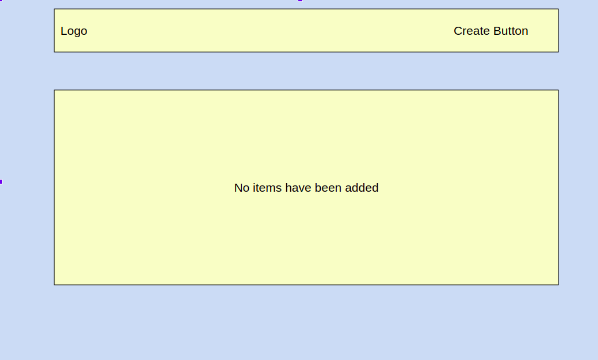
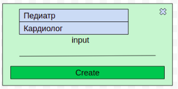
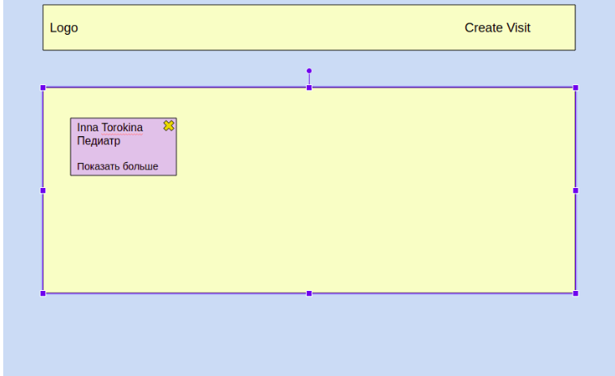

## Задание

Создать страницу, на которой пользователь сможет создавать карточки запланированных визитов к врачу.

На странице должны присутствовать:

- Header страницы (в левом верхнем углу - логотип. Можно взять любой. В правом углу - Кнопка Создать)
- Доска с визитами.

Примерный интерфейс страницы:



#### Командная работа
На данном проекте все студенты разделены на группы по два человека. Студенты могут распределять между собой задачи самостоятельно.

#### Технические требования

1) При первом посещении пользователем страницы в доске должна быть надпись `No items have been added`. Эта же надпись должна быть, если у пользователя нету ни одной добавленной карточки (например он их все удалил).
2) По клику на кнопку **Создать** появляется модальное окно, в котором можно будет создавать карточки. 

   Его примерный вид: 
   
   
   
   В модальном окне присутствует: 
   - Выпадающий список (select) с выбором врача. В зависимости от выбранного врача под этим выпадающим списком будут появлятся поля, которые нужно заполнить для визита к этому врачу.
   - В выпадающем списке должно быть три опции - `Кардиолог`, `Стоматолог`, `Терапевт`.
   - Если выбрана опция Кардиолог, появляются следующие поля для ввода информации: цель визита, обычное давление, индекс массы тела, перенесенные заболевания сердечно-сосудистой системы, возраст, ФИО. 
   - Если выбрана опция Стоматолог: цель визита, дата последнего посещения, ФИО.
   - Если выбрана опция Терапевт: цель визита, возраст, ФИО.
   - Также, независимо от выбранной опции, должно присутствовать поле ввода для дополнительных комментариев. Сюда можно ввести максимум 400 символов.
   - Кнопка `Создать`. При клике на кнопку создается карточка в Доске на странице и модальное окно закрывается.
   - Кнопка `Закрыть` - закрывает модальное окно без сохранения информации и создания карточки. По клику на область вне модального окна - модальное окно закрывается.
   - Все поля ввода, независимо от выбранной опции, кроме поля для дополнительных комментариев - обязательны для ввода данных. Валидацию на корректность данных можно не делать. 

3) Карточка, которая создается по клику, появляется на доске задач. Это должно выглядеть примерно так:

   
   
   В ней есть 
   - ФИО, которые были введены при создании карточки.
   - Врач, к которому человек записан на прием.
   - Кнопка `Показать больше`. По клику на нее карточка расширяется, и появляется остальная информация, которая была введена при создании визита.
   - кнопка `Удалить` - при нажатии на нее, заметка о визите удаляется со страницы.

Пользователь может перемещать карточки по доске методом Drag&Drop. Такие манипуляции с карточкой не влияют на месторасположение остальных карточек.

При обновлении страницы или ее закрытии уже ранее добавленные зазаметки не должны пропадать (их можно сохранять в localStorage).

#### Требования к реализации

- В JavaScript коде должен быть 1 общий класс `Визит` с такими свойствами: название визита, дата визита, ФИО пациента. 
- Кроме того, для каждого типа визита у вас должен быть свой подкласс, который наследуется от одного общего класса `Визит` и имеет свои свойства, перечисленные в ТЗ.
- Программа должна быть написана на чистом JavaScript, без использования фреймворков и библиотек.
- Карточки можно двигать по странице с помощью Drag&Drop.
- Дизайн может быть любой, но должен быть.

#### AJAX-часть

Все манипуляции с карточками (создание, обновление, удаление) должны происходить с помощью AJAX-запросов. 

Для начала работы с сервером, вам необходимо зарегистрироваться по ссылке `http://cards.danit.com.ua/register`, введя свой логин и пароль, чтобы иметь возможность работать дальше. Это действие выполняется один раз вручную в браузере.

##### POST-запросы:

1. При входе на страницу, чтобы получить возможность отправить GET-запрос на вывод всех карточек, вначале нужно авторизироваться, послав POST-запрос по адресу `http://cards.danit.com.ua/login`:

Пример запроса:

```
const data = {
  email: 'your.mail@gmail.com',
  password: "12344344аа"
};

```

Пример ответа:

```
{
  status: "Success",
  token: "b42238453cb3"
}
```

Полученый токен необходимо будет использовать во всех остальных запросах, добавив его в заголовок запроса по имени `Authorization` в виде:

```
Authorization: "Bearer ${your_token}"
```

2. Создание карточки при заполнении формы в модальном окне: вам нужно отправить POST-запрос по адресу `http://cards.danit.com.ua/cards`. 

Пример запроса:

```
const content = {
  bp: "24",
  age: 23,
  weight: 70
};

const data = {
  doctor: "cardiolog",
  title: "Цель визита",
  description: 'Краткое описание визита',
  status: "open",
  priority: "Приоритет",
  content
};
```

Если добавление прошло успешно, вы получаете объект ответа с `id` добавленой карточки в базе. Не забудьте его сохранить.

###### DELETE:

1. Удаление карточки при нажатии на крестик в верхнем правом углу карточки.

Вам нужно отправить DELETE-запрос по адресу `http://cards.danit.com.ua/cards/${cardID}`. В качестве `cardID` вы указываете уникальный номер карточки в базе, полученный вами при ее создании. В теле запроса вы передаете ваш токен.

Пример ответа:

```
{
  status: "Success"
}
```

###### GET-запросы:

1. При загрузке страницы получаем с помощью GET-запроса по адресу `http://cards.danit.com.ua/cards` список всех созданых вашей командой карточек в виде JSON-массива объектов, на их основе создаем объекты нужного класса (VisitCardio, VisitGastro и т.д.) и, используя их метод `render()`, выводим их на экран.

2. Если вы хотите получить данные об одной карточке, то отправьте GET-запрос по адресу `http://cards.danit.com.ua/cards/${cardId}`.

##### PUT:

1. Обновление карточки при ее редактировании. Отправьте PUT-запрос по адресу `http://cards.danit.com.ua/cards/${cardId}`.

Пример запроса:

```
const content = {
  bp: "24",
  age: 23,
  weight: 70
};

const data = {
  doctor: "cardiolog",
  title: "Цель визита",
  description: 'Краткое описание визита',
  status: "open",
  priority: "Приоритет",
  content
};
```
